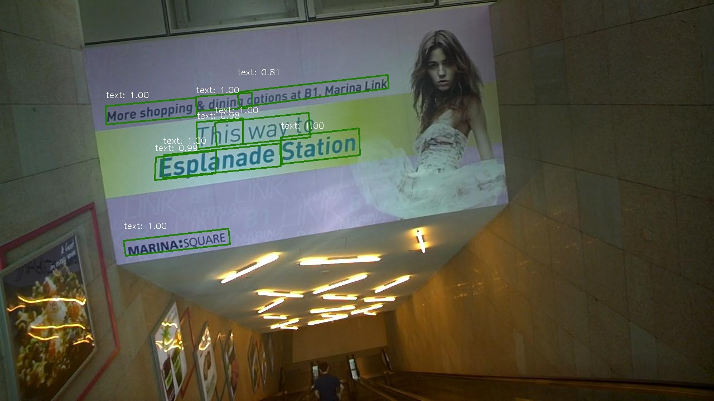

# R2CNN in PyTorch 1.2
Pytorch Implementation of "R2CNN Rotational Region CNN for Orientation Robust Scene Text Detection" [paper](https://arxiv.org/abs/1706.09579)
, it is based on facebook's [maskrcnn-benchmark](https://github.com/facebookresearch/maskrcnn-benchmark)
## Installation

Check [INSTALL.md](INSTALL.md) for installation instructions.

## Perform training on ICDAR2015 dataset
**1. Download [icdar2015](https://rrc.cvc.uab.es/?ch=4&com=downloads) dataset and pretrain model from maskrcnn-bencmark**
````
cd ./tools
mkdir datasets
ln -s PATH_ICDAR2015 datasets/ICDAR2015
mkdir pretrain
cd pretrain
wget https://download.pytorch.org/models/maskrcnn/e2e_faster_rcnn_R_50_FPN_1x.pth
````
**2. Convert annotations to COCO style**
````
cd ./tools/ICDAR2015
python convert_icdar_to_coco.py
````
**3. start training**
````
cd ./tools
python train_net.py 
````

## Inference on ICDAR 2015 dataset
**1. Download [model](https://drive.google.com/file/d/1eIJ7nl0Ei_yn3S7dDXNIhMy3BcZ48VYp/view?usp=sharing) or use your own model** 

**2. single image inference**
````
cd ./tools
python inference_engine.py
````





## New feature compared with maskrcnn-benchmark
- new data structure quad_bbox(x1, y1, x2, y2, x3, y3, x4, y4) is defined to replace bbox(x1, y1, x2, y2)
- an extra branch in box_head which regress offsets of 4 points
- post processor of rpn is adjusted to detect text objects
## TODO
- [x] 


## Citations
Please consider citing this project in your publications if it helps your research. The following is a BibTeX reference. The BibTeX entry requires the `url` LaTeX package.
```
@misc{r2cnn,
author = {Yingying Jiang, Xiangyu Zhu, Xiaobing Wang, Shuli Yang, Wei Li, Hua Wang, Pei Fu, Zhenbo Luo},
title = {R2CNN: Rotational Region CNN for Orientation Robust Scene Text Detection},
conference = {ICPR2018}
year = {2017},
}
```